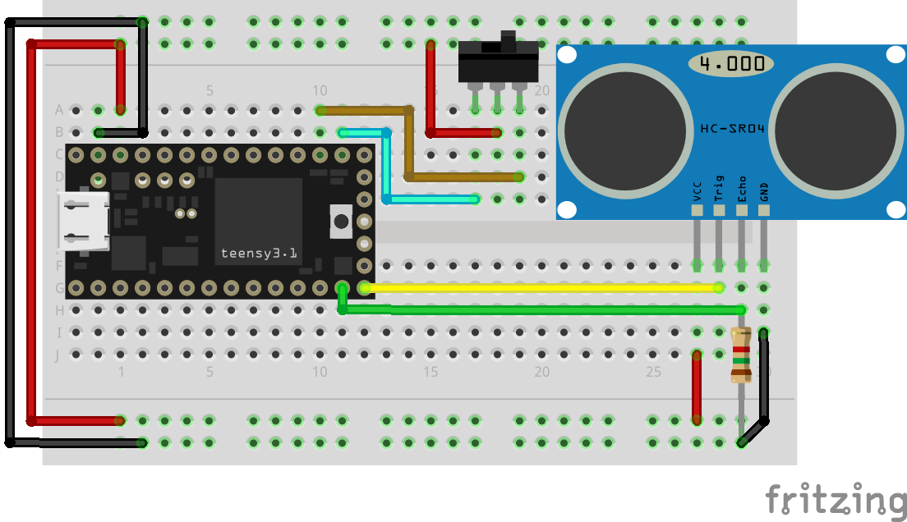

# MIDI Sensor

The current state of this project is a working prototype, that is based on a `teensy3.2` and a `HC-SR04` proximity sensor.
For cost reduction, this project will someday run on a Digistump Digispark / (Attiny85).

## ToDo

- add Switch ('up<->down', 'down<->up', 'note / cc / both')
- smoothing
- add DIN-MIDI
- make Digistump work

# Teensyduino

## Wiring 
- Teensy 3.1 / 3.2
- HC-SR04 - ultrasonic distance sensor
- a/b toggle-switch 



## Requirements

First, install [PlatformIO for Visual Studio Code](https://docs.platformio.org/en/latest/integration/ide/vscode.html).

You wont have the option of changing the USB-type to USB-MIDI, as [arduino instructions for usbMIDI](https://www.pjrc.com/teensy/td_midi.html) suggest.  
In order to do so within VSCode, execute following commands (as described by user *ivankravets* [here](https://community.platformio.org/t/teensy2-0-usb-type-midi/511/2)):

```bash
cd ~/.platformio/packages/framework-arduinoteensy/cores/teensy/
rm -rf usb_serial
cp -r ../usb_midi .
```

# Digistump

As mentioned above, this project should ultimately run on a Digistump / Attiny85. 
Any help making this work will be highly appreciated. 
So far I couldn't get the Digistump to communicate via USB, while the distance sensor is connected.

Anyway, here's what I have learned through troubleshooting so far: 

While uploading, I encountered two errors:

- SoftwareSerial.h : 
`project-inspection-error-register-r24-r26-r28-or-r30-required`
You need to fix the SoftwareSerial.cpp file of your library as described [here](https://community.platformio.org/t/project-inspection-error-register-r24-r26-r28-or-r30-required/18648/3). 

- micronucleus `usb_open(): Permission denied. [...]`, 
you'll have to execute following commands in a terminal:  

```bash
git clone git@github.com:micronucleus/micronucleus.git
cp micronucleus/commandline/49-micronucleus.rules /etc/udev/rules.d/49-micronucleus.rules
udevadm control --reload-rules
```
